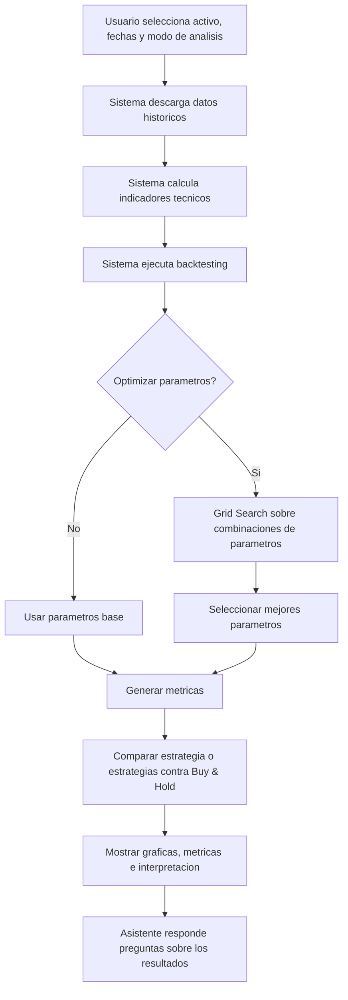
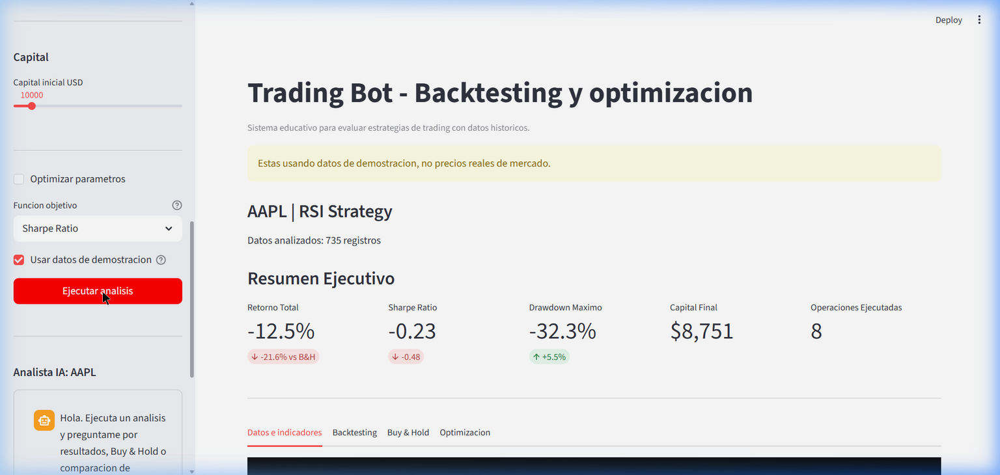
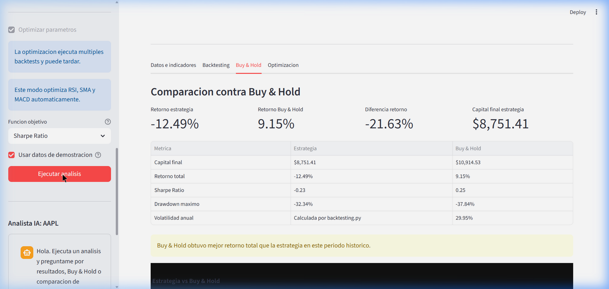
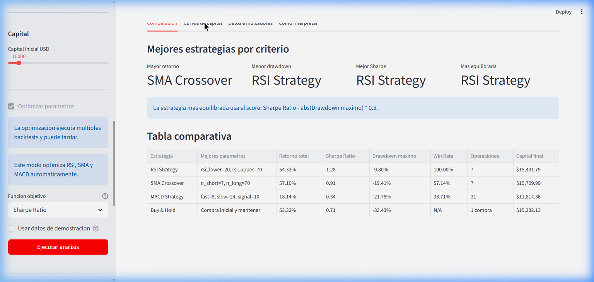
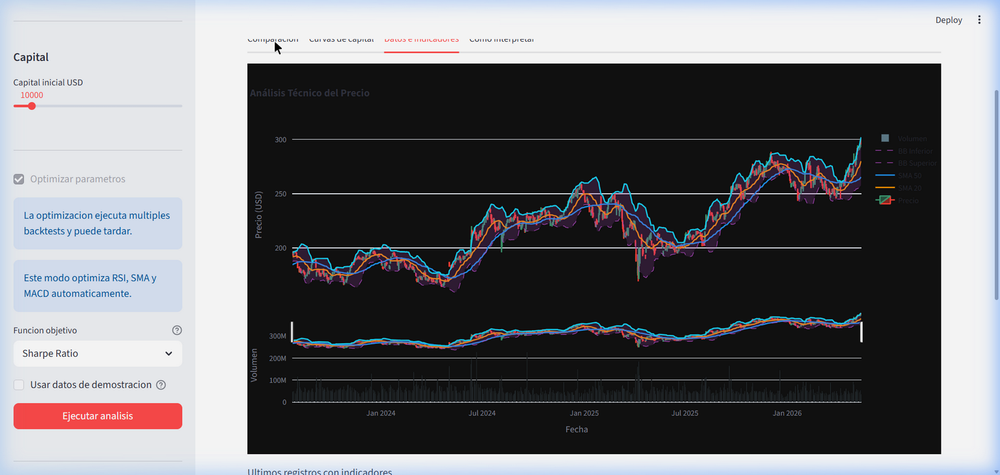

# Proyecto Final: Trading Bot Educativo con Backtesting y Optimizacion

**Curso:** Introduccion a la Inteligencia Artificial 2026-1

Este proyecto es una aplicacion interactiva en Python y Streamlit para evaluar estrategias de trading usando datos historicos. El sistema permite probar reglas tecnicas, optimizar parametros con Grid Search, comparar varias estrategias automaticamente y contrastar el resultado contra una linea base simple: Buy & Hold.

El sistema no predice el futuro ni recomienda inversiones reales. Su objetivo es probar hipotesis con datos historicos y mostrar metricas que ayuden a comparar estrategias de forma cuantitativa.

## Planteamiento del Problema

Muchos usuarios aplican indicadores tecnicos con parametros fijos, por ejemplo RSI 30/70 o medias moviles de 20 y 50 periodos, sin validar si esos parametros funcionan historicamente para un activo especifico. Esto puede generar conclusiones debiles, porque una regla que funciona para una accion puede no funcionar para una criptomoneda o para otro periodo de mercado.

Tambien es importante comparar cualquier estrategia contra una alternativa simple. Si una estrategia activa no supera a Buy & Hold, entonces puede no estar aportando valor frente a simplemente comprar el activo y mantenerlo durante el periodo evaluado.

## Objetivo General

Desarrollar una aplicacion interactiva que permita evaluar, optimizar y comparar estrategias de trading usando datos historicos, indicadores tecnicos, backtesting, comparacion contra Buy & Hold y metricas de retorno y riesgo.

## Metodologia

Flujo principal del sistema:



## Desarrollo

### Streamlit

La interfaz esta construida con Streamlit. El usuario puede seleccionar ticker, fechas, modo de analisis, estrategia, capital inicial, modo demostracion, optimizacion y funcion objetivo.

### Datos historicos

La aplicacion descarga datos OHLCV historicos desde Yahoo Finance usando el endpoint chart. Tambien incluye un modo demostracion con datos sinteticos para probar la app cuando Yahoo Finance falla o bloquea solicitudes.

### Indicadores tecnicos

El sistema calcula indicadores usados por las estrategias:

- RSI.
- MACD.
- SMA 20 y SMA 50.
- Bandas de Bollinger.

### Estrategias implementadas

El proyecto mantiene tres estrategias tecnicas:

- `RSIStrategy`.
- `SMAStrategy`.
- `MACDStrategy`.

Cada estrategia usa reglas simples de compra y venta basadas en indicadores tecnicos.

### Backtesting

El backtesting simula como se habria comportado una estrategia sobre datos historicos. La aplicacion usa `backtesting.py` para calcular operaciones, curva de capital y metricas como retorno, capital final, Sharpe Ratio, drawdown maximo, win rate y numero de operaciones.

Para activos caros como BTC-USD o ETH-USD, el motor escala internamente los precios cuando el capital inicial no alcanza para comprar una unidad completa. Esto permite simular micro-unidades y evita backtests con cero operaciones por falta de soporte fraccional en la libreria.

### Grid Search

La optimizacion se realiza con Grid Search. El sistema evalua varias combinaciones de parametros y selecciona la mejor segun una funcion objetivo:

- Sharpe Ratio.
- Score ajustado por riesgo:

```text
Score = Sharpe Ratio - abs(Max Drawdown) * 0.5
```

El score ajustado penaliza estrategias con drawdowns altos.

### Comparacion automatica de estrategias

El modo `Comparar todas las estrategias` optimiza individualmente:

- RSI Strategy.
- SMA Crossover.
- MACD Strategy.

Para cada estrategia, el sistema ejecuta Grid Search, toma los mejores parametros, calcula el backtesting resultante y compara las metricas contra Buy & Hold. La tabla comparativa incluye:

- mejores parametros;
- retorno total;
- Sharpe Ratio;
- drawdown maximo;
- Win Rate;
- numero de operaciones;
- capital final.

Tambien se genera una grafica con las curvas de capital de RSI, SMA, MACD y Buy & Hold en el mismo periodo.

El sistema identifica:

- estrategia con mayor retorno;
- estrategia con menor drawdown;
- estrategia con mejor Sharpe Ratio;
- estrategia mas equilibrada.

La estrategia mas equilibrada se calcula con:

```text
Score = Sharpe Ratio - abs(Max Drawdown) * 0.5
```

### Buy & Hold

Buy & Hold es la linea base del proyecto. Representa comprar el activo al inicio del periodo y mantenerlo hasta el final.

Formulas:

```text
Quantity = Initial Capital / Initial Price
Final Equity = Quantity * Final Price
Buy Hold Return = (Final Equity - Initial Capital) / Initial Capital
```

El sistema calcula:

- curva de capital de Buy & Hold;
- retorno total;
- capital final;
- drawdown maximo;
- volatilidad;
- Sharpe Ratio.

### Metricas

Las metricas principales son:

- **Capital final:** valor final del dinero despues de aplicar la estrategia.
- **Retorno total:** cambio porcentual del capital.
- **Sharpe Ratio:** retorno ajustado por volatilidad.
- **Drawdown maximo:** peor caida desde un maximo hasta un minimo posterior.
- **Win rate:** porcentaje de operaciones ganadoras.
- **Numero de operaciones:** cantidad de trades ejecutados.
- **Profit Factor:** relacion entre ganancias y perdidas.

### Asistente conversacional

La app incluye un asistente de apoyo con Gemini. El asistente recibe un contexto estructurado generado por la aplicacion y debe responder solo con base en esos resultados historicos. En el modo comparativo puede responder preguntas como:

- cual estrategia fue mas rentable;
- cual tuvo menor drawdown;
- cual tuvo mejor Sharpe Ratio;
- cual supero a Buy & Hold;
- cual parece mas equilibrada.

El asistente debe interpretarse como apoyo educativo. No entrega recomendaciones financieras y sus respuestas se basan solamente en los resultados historicos calculados por la aplicacion. Si Gemini no esta configurado o falla, la app usa una respuesta local basica como respaldo.

## Resultados

A continuacion se presentan los resultados obtenidos ejecutando la aplicacion con el activo AAPL (Apple Inc.) durante el periodo julio 2023 a mayo 2026 con un capital inicial de USD 10,000.

### Resultados de estrategia individual (RSI Strategy)

Se ejecuto la estrategia RSI con parametros por defecto (rsi_lower=30, rsi_upper=70, periodo=14):

| Metrica | Valor |
|---------|-------|
| Activo evaluado | AAPL (Apple Inc.) |
| Estrategia | RSI Strategy |
| Periodo analizado | Jul 2023 – May 2026 (~735 registros) |
| Parametros | rsi_lower=30, rsi_upper=70 |
| Capital inicial | $10,000 USD |
| Capital final | $8,751.41 USD |
| Retorno total | -12.49% |
| Sharpe Ratio | -0.23 |
| Drawdown maximo | -32.34% |
| Operaciones ejecutadas | 8 |



Observacion: con parametros por defecto, la estrategia RSI no supero al mercado en este periodo. Esto ilustra la importancia de la optimizacion de parametros.

### Comparacion contra Buy & Hold

La siguiente tabla muestra la comparacion directa entre la estrategia RSI (parametros por defecto) y la linea base Buy & Hold:

| Metrica | RSI Strategy | Buy & Hold |
|---------|-------------|------------|
| Capital final | $8,751.41 | $10,914.53 |
| Retorno total | -12.49% | 9.15% |
| Sharpe Ratio | -0.23 | 0.25 |
| Drawdown maximo | -32.34% | -37.84% |
| Volatilidad anual | Calculada por backtesting.py | 29.95% |

La diferencia de retorno fue de -21.63% a favor de Buy & Hold, aunque la estrategia RSI tuvo un drawdown maximo ligeramente menor (-32.34% vs -37.84%), lo que indica menor exposicion al riesgo en momentos de caida.



### Comparacion automatica de estrategias

Se ejecuto el modo "Comparar todas las estrategias" con optimizacion via Grid Search (funcion objetivo: Sharpe Ratio). Los resultados tras la optimizacion automatica de parametros:

| Estrategia | Mejores parametros | Retorno total | Sharpe Ratio | Drawdown maximo | Win Rate | Operaciones | Capital final |
|------------|-------------------|---------------|--------------|-----------------|----------|-------------|---------------|
| RSI Strategy | rsi_lower=20, rsi_upper=70 | 54.32% | 1.28 | -9.80% | 100.00% | 7 | $15,431.79 |
| SMA Crossover | n_short=7, n_long=70 | 57.10% | 0.91 | -19.41% | 57.14% | 7 | $15,709.99 |
| MACD Strategy | fast=8, slow=24, signal=10 | 18.14% | 0.34 | -21.78% | 38.71% | 31 | $11,814.36 |
| Buy & Hold | Compra inicial y mantener | 53.32% | 0.71 | -33.43% | N/A | 1 compra | $15,332.13 |

Resultados por criterio:

- **Mayor retorno:** SMA Crossover (57.10%)
- **Menor drawdown:** RSI Strategy (-9.80%)
- **Mejor Sharpe Ratio:** RSI Strategy (1.28)
- **Estrategia mas equilibrada:** RSI Strategy (score = Sharpe Ratio - abs(Drawdown maximo) * 0.5)



La comparacion demuestra que la optimizacion de parametros transforma significativamente los resultados. La RSI Strategy paso de un retorno de -12.49% (parametros por defecto) a +54.32% (parametros optimizados), superando a Buy & Hold con un drawdown considerablemente menor.



## Discusion

### Analisis de resultados

Los resultados obtenidos confirman dos hallazgos clave de la literatura financiera:

1. **La optimizacion de parametros es critica.** La estrategia RSI con parametros por defecto (30/70) obtuvo un retorno de -12.49%, mientras que con parametros optimizados (20/70) logro +54.32%. Esto demuestra que los parametros genericos no son adecuados para todos los activos ni todos los periodos, y que la busqueda sistematica de parametros (Grid Search) es esencial.

2. **Superar a Buy & Hold es dificil pero posible.** Tras la optimizacion, dos de las tres estrategias (RSI y SMA) superaron a Buy & Hold en retorno total, y las tres lograron drawdowns menores. Esto es consistente con la Hipotesis de Mercados Eficientes en su forma debil: los precios historicos contienen informacion que puede ser explotada parcialmente con analisis tecnico.

3. **El Sharpe Ratio es una metrica mas robusta que el retorno total.** SMA Crossover tuvo el mayor retorno (57.10%) pero RSI Strategy tuvo el mejor Sharpe Ratio (1.28), indicando un mejor retorno ajustado por riesgo. Esto ilustra por que evaluar estrategias solo por retorno es insuficiente.

### Limitaciones

El sistema no garantiza ganancias futuras. Los resultados dependen del activo, las fechas seleccionadas, los parametros y las condiciones historicas del mercado. Una estrategia puede verse bien en un periodo especifico y mal en otro. Por eso los resultados deben interpretarse como evidencia historica, no como prediccion.

Limitaciones adicionales del enfoque:

- **Sesgo de sobreajuste (overfitting):** la optimizacion maximiza el rendimiento en datos historicos, pero los parametros encontrados pueden no generalizar a datos futuros. Se podria mitigar con validacion walk-forward.
- **Sin costos de deslizamiento (slippage):** el backtest asume ejecucion instantanea al precio de cierre, lo cual es una simplificacion.
- **Activos fraccionales:** la libreria backtesting.py no soporta fracciones nativas; se implemento un escalado de precios como solucion.

### Relacion con el estado del arte

Este proyecto se situa en la interseccion entre analisis tecnico y optimizacion computacional, areas bien documentadas en la literatura:

- **Analisis tecnico como herramienta de decision:** Fama (1970) establecio la Hipotesis de Mercados Eficientes, donde la forma debil sugiere que los precios historicos ya reflejan toda la informacion disponible. Sin embargo, trabajos posteriores como Brock, Lakonishok y LeBaron (1992) demostraron que reglas tecnicas simples (como las medias moviles) pueden generar retornos anormales en ciertos periodos, lo cual es consistente con nuestros resultados.

- **Grid Search para optimizacion de hiperparametros:** el uso de busqueda exhaustiva de parametros es un metodo estandar en machine learning (Bergstra & Bengio, 2012). En nuestro caso, se aplica al espacio de parametros de indicadores tecnicos, tratandolos como hiperparametros de un modelo de decision.

- **Backtesting como validacion de estrategias:** plataformas como QuantConnect, Backtrader y Zipline han popularizado la simulacion historica como herramienta de validacion. Nuestro proyecto utiliza la libreria backtesting.py (Kernc, 2023), que ofrece una API compacta para Python.

- **Asistentes conversacionales como interfaz de analisis:** la integracion de LLMs como Gemini para interpretar resultados cuantitativos es una tendencia emergente en herramientas fintech, alineada con el concepto de "AI-augmented analytics" descrito por Gartner (2024).

### Conclusion

El proyecto demuestra el uso de optimizacion aplicada a un problema financiero educativo. Debe presentarse como una herramienta de analisis y validacion historica, no como una herramienta para recomendar inversiones reales.

## Instrucciones de instalacion y ejecucion

### Requisitos previos

- Python 3.11 o superior.
- pip.
- Entorno virtual del proyecto.

### Activar el entorno virtual

Desde PowerShell:

```powershell
cd "C:\Users\User\Desktop\EAFIT\Semestre 2026 -1\IA\PROYECTO FINAL\IA_Project\trading_bot"
.\.venv\Scripts\Activate.ps1
```

Si PowerShell bloquea la activacion:

```powershell
Set-ExecutionPolicy -Scope Process -ExecutionPolicy Bypass
.\.venv\Scripts\Activate.ps1
```

### Instalar dependencias

```powershell
pip install -r requirements.txt
```

### Configurar Gemini para el asistente

Crear un archivo local:

```text
.streamlit/secrets.toml
```

Con este contenido:

```toml
GEMINI_API_KEY = "tu_api_key"
```

El archivo `.streamlit/` esta ignorado por Git para evitar subir credenciales. Tambien se puede usar una variable de entorno llamada `GEMINI_API_KEY`.

### Ejecutar la aplicacion

```powershell
streamlit run app.py
```

Abrir en el navegador:

```text
http://localhost:8501
```

Si el puerto esta ocupado:

```powershell
streamlit run app.py --server.port 8502
```

## Estructura del proyecto

```text
trading_bot/
  app.py
  config/
    settings.py
  data/
    loader.py
  indicators/
    technical.py
  strategies/
    rsi_strategy.py
    sma_strategy.py
    macd_strategy.py
  backtest/
    engine.py
    optimizer.py
  ui/
    sidebar.py
    charts.py
    metrics.py
    chatbot.py
  requirements.txt
```

## Uso recomendado para la demo

### Probar comparacion contra Buy & Hold

1. Seleccionar un activo, por ejemplo `AAPL` o `BTC-USD`.
2. Seleccionar una estrategia.
3. Ejecutar el analisis.
4. Abrir la pestana `Buy & Hold`.
5. Comparar capital final, retorno, drawdown, Sharpe Ratio y curvas de capital.

### Probar optimizacion

1. Activar `Optimizar parametros`.
2. Elegir `Sharpe Ratio` o `Score ajustado por riesgo`.
3. Ejecutar el analisis.
4. Revisar la pestana `Optimizacion`.
5. Comparar parametros base contra parametros optimizados.

### Probar comparacion automatica

1. En `Modo de analisis`, seleccionar `Comparar todas las estrategias`.
2. Elegir activo, fechas, capital y funcion objetivo.
3. Ejecutar el analisis.
4. Revisar la pestana `Comparacion`.
5. Revisar la grafica `Curvas de capital`.
6. Preguntar al asistente: `Cual estrategia fue mas rentable?` o `Cual fue mas equilibrada?`.
