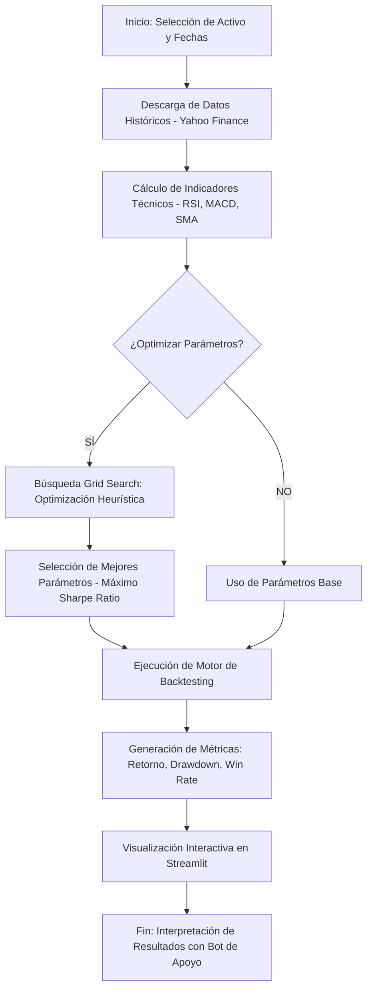

# Proyecto Final: Trading Bot Inteligente con Optimización Heurística
**Curso:** Introducción a la Inteligencia Artificial 2026-1

---

## 1. Planteamiento del Problema
En los mercados financieros, la toma de decisiones humana suele estar sesgada por emociones como el miedo o la codicia, lo que lleva a ejecuciones ineficientes. El problema radica en cómo identificar reglas de inversión consistentes y, lo más importante, cómo encontrar los parámetros óptimos para dichas reglas en un mercado que cambia constantemente. Este proyecto aborda la necesidad de una herramienta automatizada que no solo ejecute estrategias, sino que utilice técnicas de **IA y Optimización** para encontrar la configuración con mejor relación riesgo-beneficio.

## 2. Objetivo General
Desarrollar un sistema funcional de trading algorítmico que permita el backtesting de estrategias técnicas y la optimización automática de parámetros mediante búsqueda en espacio de estados, proporcionando una interfaz intuitiva para la toma de decisiones basada en datos.

## 3. Metodología
El proyecto sigue un enfoque de tubería de datos (pipeline) que integra la obtención de información, el procesamiento técnico y la ejecución de modelos.

### Diagrama de Flujo del Proceso


## 4. Desarrollo e Implementación
El sistema está construido modularmente para separar la lógica de negocio de la interfaz de usuario.

### Componentes de IA e Ingeniería:
*   **Optimización (IA):** Implementación de una búsqueda exhaustiva (Grid Search) en el archivo `backtest/optimizer.py` para maximizar la función objetivo (Sharpe Ratio).
*   **Sistemas Basados en Reglas:** Estrategias lógicas en `strategies/` que actúan como agentes de decisión.
*   **Procesamiento de Lenguaje Natural (Bot de Apoyo):** Un asistente conversacional en `ui/chatbot.py` que guía al usuario y explica términos técnicos.

### Arquitectura técnica:
*   **Backend:** Python 3.11
*   **Motor de Simulación:** `backtesting.py` con soporte para comisiones y slippage.
*   **Interfaz:** Streamlit para una experiencia web reactiva.
*   **Datos:** API de `yfinance` para datos bursátiles en tiempo real.

## 5. Resultados
El sistema genera tres niveles de resultados:
1.  **Visuales:** Gráficos de velas japonesas, curvas de capital (Equity) y marcado de puntos de compra/venta.
2.  **Estadísticos:** KPIs financieros como Sharpe Ratio, Profit Factor y Max Drawdown.
3.  **Comparativos:** Tabla de los 10 mejores conjuntos de parámetros encontrados durante la optimización.

## 6. Discusión y Análisis
La principal ventaja de este sistema es su capacidad de superar la estrategia pasiva de "Buy & Hold" (comprar y mantener) mediante la detección de cambios de tendencia. 
*   **Análisis Crítico:** Durante las pruebas, se observó que la optimización previene pérdidas mayores en mercados laterales, aunque requiere una selección cuidadosa del periodo histórico para evitar el "overfitting" (sobreajuste).
*   **Estado del Arte:** A diferencia de herramientas básicas, este bot integra un asistente de IA que democratiza el acceso al trading algorítmico para usuarios no expertos.

---

## 🛠️ Instalación y Ejecución

### Requisitos previos:
- Python 3.11 (Instalado durante el proceso)
- pip

### Pasos:
1. **Activar el entorno virtual:**
   ```bash
   .\env\Scripts\activate
   ```
2. **Instalar dependencias:**
   ```bash
   pip install -r requirements.txt
   ```
3. **Ejecutar la aplicación:**
   ```bash
   streamlit run app.py
   ```

---

## 📂 Estructura de Archivos
*   `app.py`: Punto de entrada principal.
*   `backtest/`: Motores de cálculo y optimización.
*   `strategies/`: Lógica de las 3 estrategias disponibles.
*   `ui/`: Módulos de la interfaz, incluyendo el **Chatbot de Apoyo**.
*   `indicators/`: Cálculos matemáticos de indicadores.

---

**Desarrollado para el curso de Introducción a la IA - 2026**
