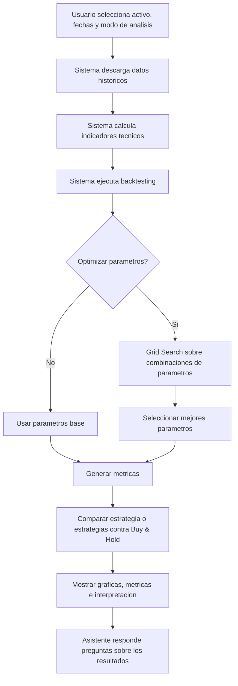

# Proyecto Final: Trading Bot Educativo con Backtesting y Optimizacion

**Curso:** Introduccion a la Inteligencia Artificial 2026-1

Este proyecto es una aplicacion interactiva en Python y Streamlit para evaluar estrategias de trading usando datos historicos. El sistema permite probar reglas tecnicas, optimizar parametros con Grid Search, comparar varias estrategias automaticamente y contrastar el resultado contra una linea base simple: Buy & Hold.

El sistema no predice el futuro ni recomienda inversiones reales. Su objetivo es probar hipotesis con datos historicos y mostrar metricas que ayuden a comparar estrategias de forma cuantitativa.

## Planteamiento del Problema

Muchos usuarios aplican indicadores tecnicos con parametros fijos, por ejemplo RSI 30/70 o medias moviles de 20 y 50 periodos, sin validar si esos parametros funcionan historicamente para un activo especifico. Esto puede generar conclusiones debiles, porque una regla que funciona para una accion puede no funcionar para una criptomoneda o para otro periodo de mercado.

Tambien es importante comparar cualquier estrategia contra una alternativa simple. Si una estrategia activa no supera a Buy & Hold, entonces puede no estar aportando valor frente a simplemente comprar el activo y mantenerlo durante el periodo evaluado.

## Objetivo General

Desarrollar una aplicacion interactiva que permita evaluar, optimizar y comparar estrategias de trading usando datos historicos, indicadores tecnicos, backtesting, comparacion contra Buy & Hold y metricas de retorno y riesgo.

## Metodologia

Flujo principal del sistema:



## Desarrollo

### Streamlit

La interfaz esta construida con Streamlit. El usuario puede seleccionar ticker, fechas, modo de analisis, estrategia, capital inicial, modo demostracion, optimizacion y funcion objetivo.

### Datos historicos

La aplicacion descarga datos OHLCV historicos desde Yahoo Finance usando el endpoint chart. Tambien incluye un modo demostracion con datos sinteticos para probar la app cuando Yahoo Finance falla o bloquea solicitudes.

### Indicadores tecnicos

El sistema calcula indicadores usados por las estrategias:

- RSI.
- MACD.
- SMA 20 y SMA 50.
- Bandas de Bollinger.

### Estrategias implementadas

El proyecto mantiene tres estrategias tecnicas:

- `RSIStrategy`.
- `SMAStrategy`.
- `MACDStrategy`.

Cada estrategia usa reglas simples de compra y venta basadas en indicadores tecnicos.

### Backtesting

El backtesting simula como se habria comportado una estrategia sobre datos historicos. La aplicacion usa `backtesting.py` para calcular operaciones, curva de capital y metricas como retorno, capital final, Sharpe Ratio, drawdown maximo, win rate y numero de operaciones.

Para activos caros como BTC-USD o ETH-USD, el motor escala internamente los precios cuando el capital inicial no alcanza para comprar una unidad completa. Esto permite simular micro-unidades y evita backtests con cero operaciones por falta de soporte fraccional en la libreria.

### Grid Search

La optimizacion se realiza con Grid Search. El sistema evalua varias combinaciones de parametros y selecciona la mejor segun una funcion objetivo:

- Sharpe Ratio.
- Score ajustado por riesgo:

```text
Score = Sharpe Ratio - abs(Max Drawdown) * 0.5
```

El score ajustado penaliza estrategias con drawdowns altos.

### Comparacion automatica de estrategias

El modo `Comparar todas las estrategias` optimiza individualmente:

- RSI Strategy.
- SMA Crossover.
- MACD Strategy.

Para cada estrategia, el sistema ejecuta Grid Search, toma los mejores parametros, calcula el backtesting resultante y compara las metricas contra Buy & Hold. La tabla comparativa incluye:

- mejores parametros;
- retorno total;
- Sharpe Ratio;
- drawdown maximo;
- Win Rate;
- numero de operaciones;
- capital final.

Tambien se genera una grafica con las curvas de capital de RSI, SMA, MACD y Buy & Hold en el mismo periodo.

El sistema identifica:

- estrategia con mayor retorno;
- estrategia con menor drawdown;
- estrategia con mejor Sharpe Ratio;
- estrategia mas equilibrada.

La estrategia mas equilibrada se calcula con:

```text
Score = Sharpe Ratio - abs(Max Drawdown) * 0.5
```

### Buy & Hold

Buy & Hold es la linea base del proyecto. Representa comprar el activo al inicio del periodo y mantenerlo hasta el final.

Formulas:

```text
Quantity = Initial Capital / Initial Price
Final Equity = Quantity * Final Price
Buy Hold Return = (Final Equity - Initial Capital) / Initial Capital
```

El sistema calcula:

- curva de capital de Buy & Hold;
- retorno total;
- capital final;
- drawdown maximo;
- volatilidad;
- Sharpe Ratio.

### Metricas

Las metricas principales son:

- **Capital final:** valor final del dinero despues de aplicar la estrategia.
- **Retorno total:** cambio porcentual del capital.
- **Sharpe Ratio:** retorno ajustado por volatilidad.
- **Drawdown maximo:** peor caida desde un maximo hasta un minimo posterior.
- **Win rate:** porcentaje de operaciones ganadoras.
- **Numero de operaciones:** cantidad de trades ejecutados.
- **Profit Factor:** relacion entre ganancias y perdidas.

### Asistente conversacional

La app incluye un asistente de apoyo que interpreta resultados historicos. En el modo comparativo puede responder preguntas como:

- cual estrategia fue mas rentable;
- cual tuvo menor drawdown;
- cual tuvo mejor Sharpe Ratio;
- cual supero a Buy & Hold;
- cual parece mas equilibrada.

El asistente debe interpretarse como apoyo educativo. No entrega recomendaciones financieras y sus respuestas se basan solamente en los resultados historicos calculados por la aplicacion.

## Resultados

Esta seccion queda preparada para incluir capturas o ejemplos obtenidos durante la sustentacion.

### Resultados de la estrategia

Incluir:

- activo evaluado;
- estrategia seleccionada;
- periodo analizado;
- parametros usados;
- capital inicial;
- capital final;
- retorno total;
- Sharpe Ratio;
- drawdown maximo;
- numero de operaciones.

### Comparacion contra Buy & Hold

Incluir:

- capital final de la estrategia;
- capital final de Buy & Hold;
- retorno de la estrategia;
- retorno de Buy & Hold;
- diferencia de retorno;
- Sharpe Ratio de ambos;
- drawdown maximo de ambos;
- grafica comparativa de curvas de capital.

### Comparacion automatica de estrategias

Incluir:

- tabla comparativa de RSI, SMA, MACD y Buy & Hold;
- curva de capital conjunta;
- estrategia con mayor retorno;
- estrategia con menor drawdown;
- estrategia con mejor Sharpe Ratio;
- estrategia mas equilibrada;
- respuesta del asistente ante una pregunta comparativa.

## Discusion

El sistema no garantiza ganancias futuras. Los resultados dependen del activo, las fechas seleccionadas, los parametros y las condiciones historicas del mercado.

Una estrategia puede verse bien en un periodo especifico y mal en otro. Por eso los resultados deben interpretarse como evidencia historica, no como prediccion. La comparacion contra Buy & Hold permite saber si la estrategia realmente aporta valor frente a una alternativa simple.

La comparacion automatica mejora el analisis porque evita evaluar una sola estrategia de forma aislada. Sin embargo, elegir la mejor estrategia historica no garantiza que esa misma estrategia funcione en el futuro.

El proyecto demuestra el uso de optimizacion aplicada a un problema financiero, pero debe presentarse como una herramienta de analisis y validacion, no como una herramienta para recomendar inversiones reales.

## Instrucciones de instalacion y ejecucion

### Requisitos previos

- Python 3.11 o superior.
- pip.
- Entorno virtual del proyecto.

### Activar el entorno virtual

Desde PowerShell:

```powershell
cd "C:\Users\User\Desktop\EAFIT\Semestre 2026 -1\IA\PROYECTO FINAL\IA_Project\trading_bot"
.\.venv\Scripts\Activate.ps1
```

Si PowerShell bloquea la activacion:

```powershell
Set-ExecutionPolicy -Scope Process -ExecutionPolicy Bypass
.\.venv\Scripts\Activate.ps1
```

### Instalar dependencias

```powershell
pip install -r requirements.txt
```

### Ejecutar la aplicacion

```powershell
streamlit run app.py
```

Abrir en el navegador:

```text
http://localhost:8501
```

Si el puerto esta ocupado:

```powershell
streamlit run app.py --server.port 8502
```

## Estructura del proyecto

```text
trading_bot/
  app.py
  config/
    settings.py
  data/
    loader.py
  indicators/
    technical.py
  strategies/
    rsi_strategy.py
    sma_strategy.py
    macd_strategy.py
  backtest/
    engine.py
    optimizer.py
  ui/
    sidebar.py
    charts.py
    metrics.py
    chatbot.py
  requirements.txt
```

## Uso recomendado para la demo

### Probar comparacion contra Buy & Hold

1. Seleccionar un activo, por ejemplo `AAPL` o `BTC-USD`.
2. Seleccionar una estrategia.
3. Ejecutar el analisis.
4. Abrir la pestana `Buy & Hold`.
5. Comparar capital final, retorno, drawdown, Sharpe Ratio y curvas de capital.

### Probar optimizacion

1. Activar `Optimizar parametros`.
2. Elegir `Sharpe Ratio` o `Score ajustado por riesgo`.
3. Ejecutar el analisis.
4. Revisar la pestana `Optimizacion`.
5. Comparar parametros base contra parametros optimizados.

### Probar comparacion automatica

1. En `Modo de analisis`, seleccionar `Comparar todas las estrategias`.
2. Elegir activo, fechas, capital y funcion objetivo.
3. Ejecutar el analisis.
4. Revisar la pestana `Comparacion`.
5. Revisar la grafica `Curvas de capital`.
6. Preguntar al asistente: `Cual estrategia fue mas rentable?` o `Cual fue mas equilibrada?`.
